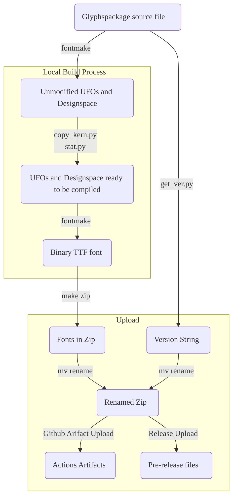

# Build Process

```mermaid

%%{init:
{
  "theme": "default",
  "themeVariables": {
    "fontFamily": "-apple-system, system-ui, sans-serif",
    "fontSize": "16px"
 }
}
}%%

flowchart TD;

    id1("Glyphspackage source file") -- "fontmake" --> id2("Unmodified UFOs and Designspace")

    subgraph "Local Build Process"
    id2 -- "copy_kern.py \n stat.py" --> id3("UFOs and Designspace ready to be compiled")
    id3 -- "fontmake" --> id4("Binary TTF font")
    end

    id1 -- "get_ver.py" --> id21("Version String")
    subgraph "Upload"
    id4 -- "make zip" --> id5("Fonts in Zip")
    id5 & id21 -- "mv rename" --> id6("Renamed Zip")
    id6 -- "Github Arifact Upload" --> id7("Actions Artifacts")
    id6 -- "Release Upload" --> id8("Pre-release files")
    end

```